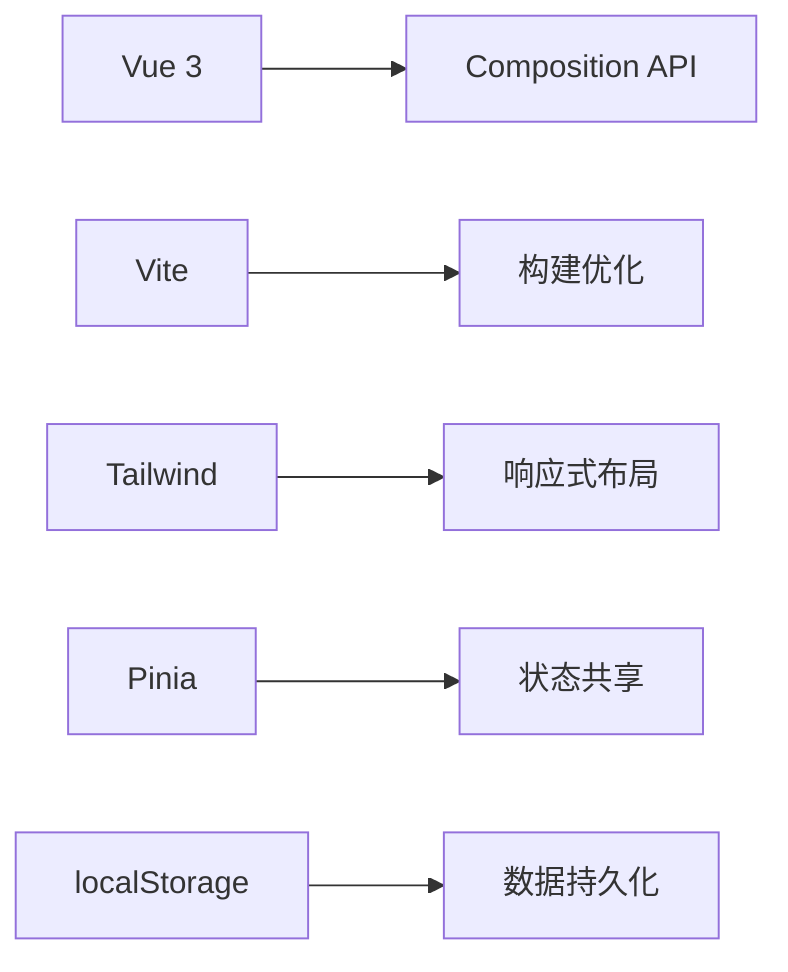
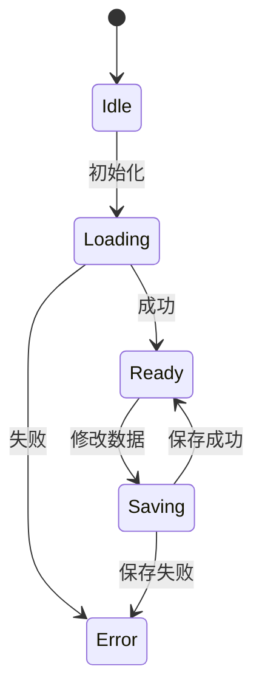
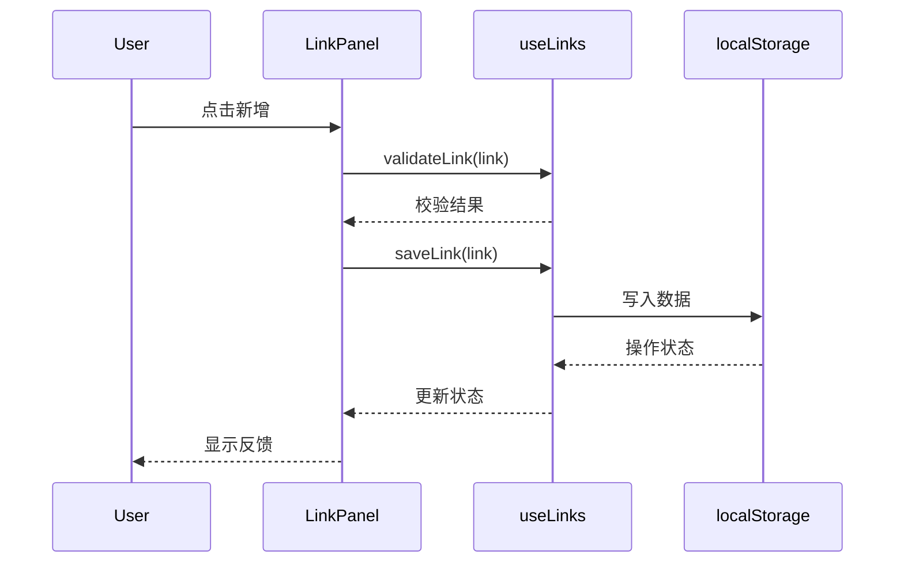

# OneBoard 架构设计文档 v2

## 1. 项目概述
**技术特性**：
- 零后端依赖
- 支持PWA离线运行
- 数据版本化迁移

## 2. 技术架构


## 3. 模块设计

### 3.1 快捷链接模块
- **数据版本控制**：
  ```typescript
  interface StorageSchema {
    _version: '1.0'
    links: QuickLink[]
  }
  ```
- **错误边界**：
  - 无效URL自动过滤
  - 重复链接提示

### 3.2 任务管理模块
新增状态机设计：


## 4. 交互流程


## 5. 项目结构（更新）
```
src/
├── components/
│ ├── links/ # 链接相关组件
│ └── tasks/ # 任务相关组件
├── composables/ # 组合式函数
│ ├── useStorage.js # 基础存储操作
│ ├── useLinks.js # 链接业务逻辑
│ └── useTasks.js # 任务业务逻辑
├── constants/ # 常量数据
│ └── defaultLinks.js # 默认链接配置
├── stores/ # Pinia状态管理
└── assets/ # 静态资源
```

## 6. 技术决策表
| 领域        | 方案                | 备选方案           |
|------------|--------------------|-------------------|
| 表单验证     | 原生URL API        | zod               |
| 图标方案     | Heroicons SVG      | 图标字体           |
| 异常处理     | 错误边界组件        | try/catch全局处理  |

## 7. 扩展性考虑
1. 未来可接入浏览器书签API
2. 支持导出/导入数据（JSON格式）
3. 主题切换能力预留

## 技术架构
+ 组件库: @headlessui/vue (按需引入)

## 5.2 组件库选型
- 基础交互组件：@headlessui/vue
- 图标方案：使用原生SVG或[heroicons](https://heroicons.com/)

### 数据持久化策略
- 版本控制：通过`_version`字段实现数据迁移
- 默认数据：内置常见开发工具链接（GitHub/Jira等）
