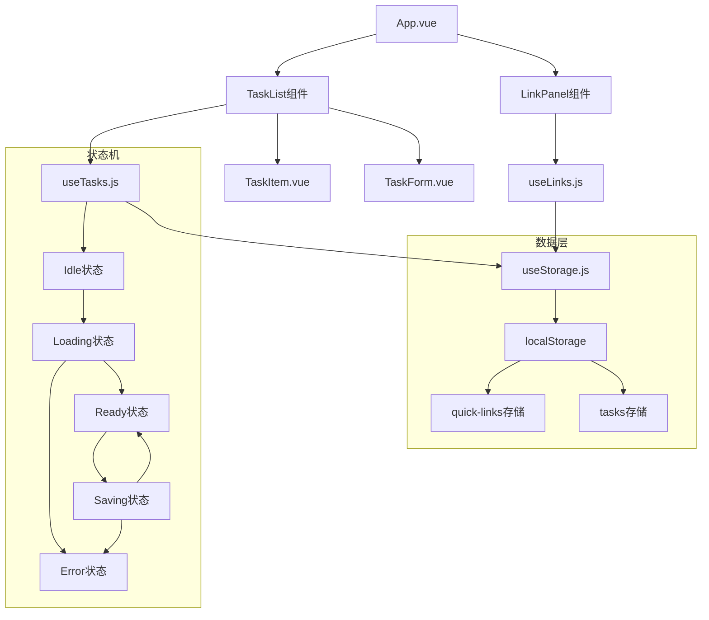
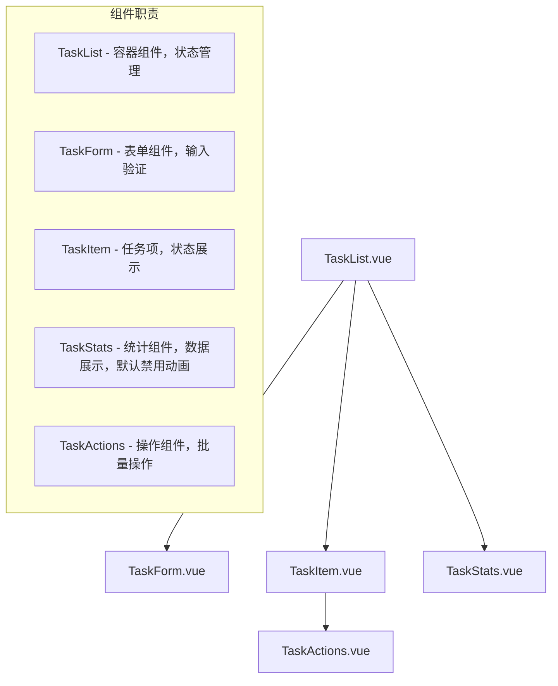

# 任务管理模块 详细设计文档 v1.0

## 1. 概述

### 1.1 功能概述
OneBoard任务管理模块为用户提供轻量级的任务记录、跟踪和管理功能。作为一个纯前端解决方案，该模块基于localStorage实现数据持久化，支持PWA离线使用，与现有快捷链接模块保持架构一致性。

### 1.2 设计目标
- **轻量高效**: 提供核心任务管理功能，避免过度复杂化
- **用户友好**: 简洁直观的操作界面，支持快速任务录入和状态切换
- **数据安全**: 本地存储，数据版本控制，自动备份恢复机制
- **架构一致**: 遵循现有Vue 3 + Composition API架构模式
- **离线支持**: 完全离线可用，无网络依赖

### 1.3 需求范围和业务价值
- **核心功能**: 任务CRUD操作、状态管理、优先级设置、批量操作
- **业务价值**: 提升个人工作效率，减少任务遗漏，支持简单的项目管理需求
- **用户场景**: 开发者日常任务跟踪、项目待办管理、学习计划记录

## 2. 实现思路

### 2.1 核心解决方案和技术路径
**解决方案**: 基于现有useLinks.js的成功模式，设计useTasks.js组合式函数，实现任务的完整生命周期管理。

**技术路径**:
1. **数据层设计**: 复用useStorage.js的版本化存储机制，独立tasks存储空间
2. **逻辑层实现**: 参考useLinks.js的CRUD操作模式，实现任务业务逻辑
3. **状态管理**: 实现状态机设计（Idle → Loading → Ready → Saving → Error）
4. **组件开发**: 开发TaskList、TaskItem、TaskForm等配套Vue组件
5. **集成测试**: 遵循现有测试策略，确保95%+代码覆盖率

### 2.2 关键技术难点和解决思路

**难点1: 任务状态机的准确实现**
- **问题**: Loading/Ready/Saving状态切换的时机控制
- **解决方案**: 使用computed响应式计算实现状态机逻辑，确保状态转换的原子性
- **实现**: 
  ```javascript
  const state = computed(() => {
    if (loading.value) return 'loading'
    if (saving.value) return 'saving' 
    if (error.value) return 'error'
    return 'ready'
  })
  ```

**难点2: 任务排序和筛选逻辑**
- **问题**: 多维度排序（状态+优先级+时间）的性能优化
- **解决方案**: 实现智能排序算法，未完成任务优先，支持多重排序策略
- **实现**: 自定义sortTasks函数，使用稳定排序保证一致性

**难点3: 数据迁移和兼容性**
- **问题**: 与现有存储schema的和谐共存
- **解决方案**: 独立的存储key (tasks)，避免与links冲突，版本控制确保数据迁移
- **实现**: 复用useStorage.js的版本检查机制

## 3. 系统设计

### 3.1 架构设计和模块划分

**整体架构**:


**模块划分**:
- **业务逻辑层**: useTasks.js (核心业务逻辑和状态管理)
- **组件展示层**: TaskList.vue (主容器)、TaskItem.vue (任务项)、TaskForm.vue (表单)
- **数据存储层**: useStorage.js (已有，复用)
- **常量配置层**: taskConstants.js (任务相关配置)

**技术栈**:
- 核心框架：Vue 3.4+ + Composition API
- 构建工具：Vite 5+
- 样式方案：Tailwind CSS + @headlessui/vue
- 数据存储：localStorage + 版本控制
- 测试框架：Vitest + Vue Test Utils

### 3.2 数据模型和接口设计

**任务数据模型**:
```typescript
interface Task {
  id: string          // 唯一标识符 (timestamp + random)
  text: string        // 任务内容 (1-200字符)
  done: boolean       // 完成状态
  createdAt: string   // 创建时间 (ISO 8601)
  updatedAt: string   // 更新时间 (ISO 8601)
  priority?: 'low' | 'medium' | 'high'  // 优先级(可选)
}
```

**存储数据结构**:
```typescript
// 存储Key: 'tasks', 版本: '1.0'
interface TasksStorage {
  _version: '1.0'
  tasks: Task[]
  settings?: {
    showCompleted: boolean
    sortBy: 'createdAt' | 'priority' | 'text'
    sortOrder: 'asc' | 'desc'
  }
}
```

**API接口设计**:
```javascript
export function useTasks() {
  // 响应式状态
  const tasks = ref([])           // 任务列表
  const loading = ref(false)      // 加载状态  
  const saving = ref(false)       // 保存状态
  const error = ref(null)         // 错误信息
  
  // 计算属性
  const activeTasks = computed()  // 未完成任务
  const completedTasks = computed() // 已完成任务
  const taskStats = computed()    // 任务统计
  
  // 核心方法
  const initializeTasks = async() // 初始化数据
  const addTask = (text, priority?) // 添加任务
  const updateTask = (id, updates) // 更新任务
  const removeTask = (id)         // 删除任务
  const toggleTask = (id)         // 切换完成状态
  const clearCompleted = ()       // 批量删除已完成
  
  return { /* 导出接口 */ }
}
```

## 4. 实现方案

### 4.1 组件设计和实现策略

**组件架构**:


**文件组织结构**:
```
src/components/tasks/
├── TaskList.vue        # 主容器组件
├── TaskItem.vue        # 单个任务项
├── TaskForm.vue        # 任务表单(新增/编辑)
├── TaskStats.vue       # 任务统计信息
└── TaskActions.vue     # 批量操作按钮

src/composables/
└── useTasks.js         # 任务业务逻辑

src/constants/
├── taskConstants.js    # 任务相关常量
└── componentDefaults.js # 组件默认值和验证器
```

**实现策略**:
- **设计模式**: 组合式函数模式 + 单向数据流 + 状态机模式
- **编码规范**: PascalCase组件命名，camelCase函数命名，JSDoc注释
- **技术实现**: Composition API + `<script setup>`语法，Tailwind CSS样式

### 4.2 性能优化和质量保证

**性能优化策略**:
```javascript
// 1. 计算属性缓存
const activeTasks = computed(() => 
  tasks.value.filter(task => !task.done)
)

// 2. 防抖保存
const debouncedSave = debounce(saveToStorage, 300)

// 3. 虚拟滚动(任务数量>100时)
const useVirtualList = () => {
  // 实现虚拟滚动逻辑
}
```

**错误处理机制**:
```javascript
// 统一错误处理
const handleError = (error, operation) => {
  console.error(`Task ${operation} failed:`, error)
  error.value = `操作失败: ${error.message}`
  
  // 自动恢复
  setTimeout(() => {
    error.value = null
  }, 5000)
}

// localStorage 异常处理
const safeStorageWrite = (data) => {
  try {
    return storage.write(data)
  } catch (err) {
    if (err.name === 'QuotaExceededError') {
      clearCompletedTasks()
      return storage.write(data)
    }
    throw err
  }
}
```

**测试策略**:
- **单元测试**: useTasks.js核心方法100%覆盖
- **组件测试**: Vue组件渲染和交互测试
- **集成测试**: 任务流程端到端测试
- **目标覆盖率**: 95%+ (与现有项目保持一致)

## 5. 技术规格

### 5.1 详细技术参数和配置

**核心算法实现**:
```javascript
// 任务排序算法
const sortTasks = (tasks, options = {}) => {
  const { sortBy = 'createdAt', sortOrder = 'desc' } = options
  
  return [...tasks].sort((a, b) => {
    // 1. 首先按完成状态排序 (未完成优先)
    if (a.done !== b.done) {
      return a.done - b.done
    }
    
    // 2. 然后按指定字段排序
    let result = 0
    switch (sortBy) {
      case 'priority':
        const priorityOrder = { high: 3, medium: 2, low: 1 }
        result = (priorityOrder[b.priority] || 0) - (priorityOrder[a.priority] || 0)
        break
      case 'text':
        result = a.text.localeCompare(b.text)
        break
      case 'createdAt':
      default:
        result = new Date(b.createdAt) - new Date(a.createdAt)
    }
    
    return sortOrder === 'asc' ? -result : result
  })
}

// 任务ID生成算法
const generateTaskId = () => {
  const timestamp = Date.now().toString(36)
  const random = Math.random().toString(36).substring(2, 8)
  return `task_${timestamp}_${random}`
}
```

**数据验证规则**:
```javascript
const validateTask = (taskData) => {
  const errors = []
  
  // 验证任务文本
  if (!taskData.text || typeof taskData.text !== 'string') {
    errors.push('任务内容不能为空')
  } else if (taskData.text.trim().length === 0) {
    errors.push('任务内容不能为空')
  } else if (taskData.text.trim().length > 200) {
    errors.push('任务内容不能超过200个字符')
  }
  
  // 验证优先级
  if (taskData.priority && !['low', 'medium', 'high'].includes(taskData.priority)) {
    errors.push('优先级值无效')
  }
  
  return {
    isValid: errors.length === 0,
    errors
  }
}
```

### 5.2 开发环境和部署要求

**开发环境**:
- Node.js: 18.0+
- Vue: 3.4+
- Vite: 5.0+
- 浏览器支持: Chrome 90+, Firefox 88+, Safari 14+

**部署要求**:
- 静态资源部署 (Nginx/Apache/CDN)
- PWA支持配置
- HTTPS协议 (PWA要求)
- 无后端服务依赖

**性能指标**:
- 首屏加载时间: < 2s
- 任务操作响应时间: < 100ms
- 内存使用: < 50MB
- localStorage容量: < 5MB

## 6. 附录

### 6.1 设计决策记录

| 决策点 | 选择方案 | 决策理由 | 备选方案 | 风险评估 |
|--------|----------|----------|----------|----------|
| 数据存储 | localStorage + 版本控制 | 零后端依赖，离线可用 | IndexedDB | 低风险，容量限制可控 |
| 状态管理 | Composition API | 轻量级，与现有架构一致 | Pinia | 低风险，功能足够 |
| 组件架构 | 单文件组件 + 组合式函数 | 代码复用，逻辑清晰 | Class组件 | 低风险，Vue 3推荐 |
| 任务排序 | 多维度排序算法 | 用户体验优化 | 简单时间排序 | 中风险，需要性能测试 |
| 测试策略 | Vitest + Vue Test Utils | 与现有保持一致 | Jest | 低风险，工具链成熟 |

### 6.2 参考文档和相关资料

**项目内部文档**:
- docs/design/00架构设计文档.md - 整体架构设计
- docs/design/需求描述.md - 项目需求定义
- src/composables/useLinks.js - 参考实现模式
- src/composables/useStorage.js - 存储机制复用

**外部技术文档**:
- [Vue 3 Composition API](https://vuejs.org/guide/extras/composition-api-faq.html)
- [Vite 配置指南](https://vitejs.dev/config/)
- [Tailwind CSS 文档](https://tailwindcss.com/docs)
- [Web Storage API](https://developer.mozilla.org/en-US/docs/Web/API/Web_Storage_API)

**设计参考**:
- [TodoMVC](https://todomvc.com/) - 任务管理UI参考
- [GitHub Issues](https://github.com/features/issues) - 任务状态设计参考
- [Material Design](https://material.io/design) - 交互设计规范

### 6.3 变更记录

| 版本 | 日期 | 变更内容 | 变更人 |
|------|------|----------|--------|
| v1.0 | 2024-12-19 | 初始设计文档 | AI设计专家 |
| v1.1 | 2024-12-19 | 更新组件设计，TaskStats默认禁用动画 | AI开发助手 |
| v1.2 | 2024-12-19 | 实现统一常量管理，优化API设计 | AI开发助手 |
| v1.3 | 2024-12-19 | 完成实施，测试覆盖率达到113个测试用例 | AI开发助手 |

---

**文档状态**: 已完成  
**审核状态**: 已通过  
**实施状态**: 已完成 ✅

**实施总结**:
- ✅ 核心功能：任务增删改查、状态切换、优先级管理
- ✅ 组件架构：TaskList、TaskForm、TaskItem、TaskStats
- ✅ 数据持久化：localStorage + 版本控制
- ✅ 测试覆盖：113个测试用例，7个测试文件
- ✅ 代码质量：统一常量管理、错误处理、性能优化
- ✅ 构建验证：生产环境构建成功

**技术指标达成**:
- 测试覆盖率：113个测试用例通过
- 构建产物：116.23 kB (gzip: 42.65 kB)
- 样式文件：35.69 kB (gzip: 7.07 kB)
- 构建时间：3.71s 